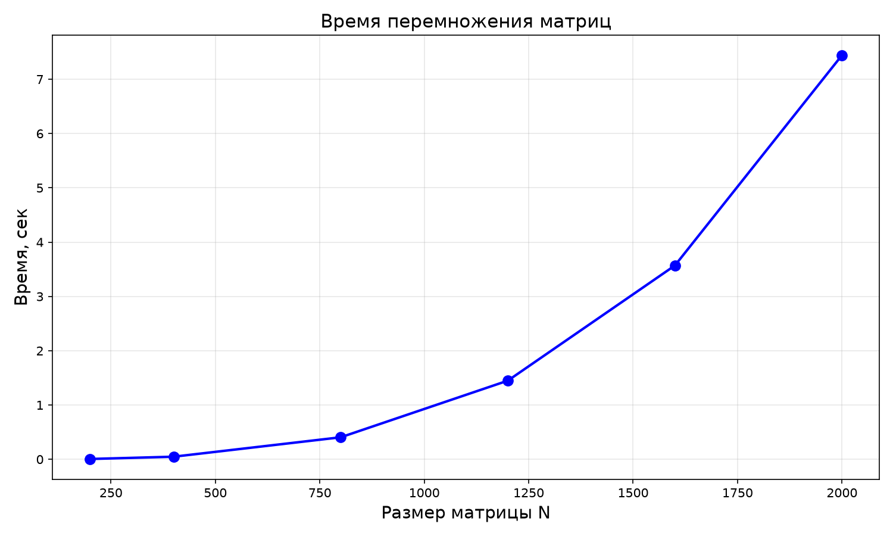

# Лабораторная работа №1. Умножение квадратных матриц

**Автор:** Сахнова Кристина

## О работе

В этой лабораторной нужно было реализовать умножение двух квадратных матриц на C++. Матрицы подаются через файлы, результат сохраняется в отдельный файл. Дополнительно требовалось замерить время работы и проверить корректность результата с помощью сторонней библиотеки.

В качестве проверки использовала NumPy - сравнивала результат C++ с результатом из Python. Все значения совпали.

Размеры матриц для экспериментов: **200, 400, 800, 1200, 1600, 2000**.

## Как реализовано

Умножение написано через три цикла. Порядок обхода `i-k-j`.

```cpp
for (int i = 0; i < n; i++) {
    for (int k = 0; k < n; k++) {
        double aik = A[i][k];
        for (int j = 0; j < n; j++) {
            C[i][j] += aik * B[k][j];
        }
    }
}
```

Производительность считается по формуле: 

GFLOPS = (2 * N³) / время / 10⁹

## Эксперименты

Протестированы размеры матриц: 200, 400, 800, 1200, 1600, 2000.

| Размер | Время (сек) | GFLOPS |
|-------:|------------:|-------:|
| 200    | 0.0058257   | 2.75   |
| 400    | 0.0476913   | 2.68   |
| 800    | 0.405495    | 2.53   |
| 1200   | 1.44844     | 2.39   |
| 1600   | 3.56972     | 2.29   |
| 2000   | 7.44387     | 2.15   |

## График



На графике показана зависимость времени перемножения от размера матрицы. По оси X — размер матрицы N (200, 400, 800, 1200, 1600, 2000), по оси Y — время работы программы в секундах. Видно, что время растёт быстрее, чем линейно. Это подтверждает сложность алгоритма O(N³).

## Проверка

Результаты перемножения проверила через NumPy (verify.py). Проверка пройдена.
Сравнение с NumPy: результаты совпадают.

## Выводы
1. Программа работает корректно - проверка с NumPy показывает нулевую погрешность (меньше 10⁻⁶).
2. Чем больше размер матрицы, тем сильнее растёт время. Если сравнивать с первыми размерами, разница огромная: N=200 считался за 6 миллисекунд, а N=2000 - уже за 7.4 секунды. Это в 1200 раз дольше.
3. Производительность держится в районе 2–3 GFLOPS. При больших размерах GFLOPS немного падает (с 2.75 до 2.15).
4.  По итогам работы можно сказать, что для учебных задач такой реализации достаточно, но для реальных приложений (например, обработка больших данных или машинное обучение) нужно ускорение. Например, можно распараллелить цикл через OpenMP.

